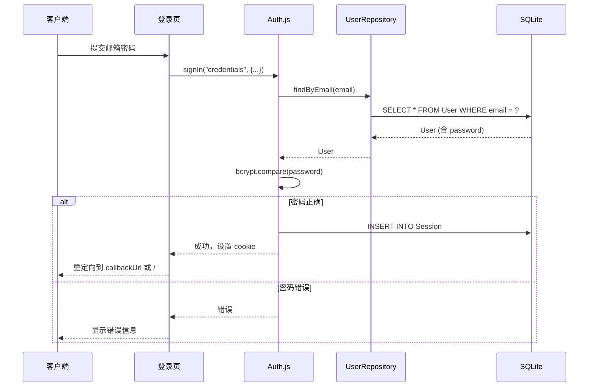
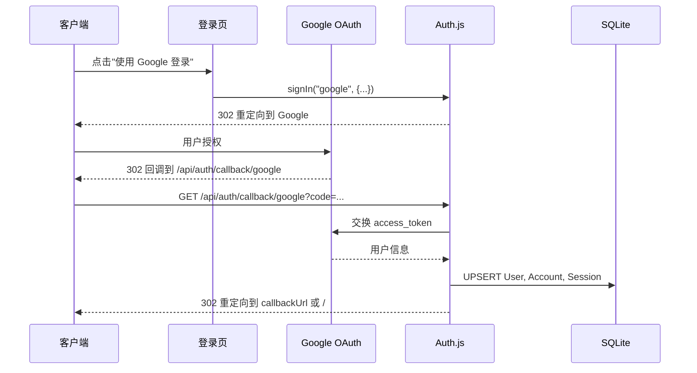

# HTTP 接口设计文档

## 概述

本文档描述用户认证与用户管理系统的所有 HTTP 接口。由于使用 Next.js App Router，主要采用 **Server Actions**（服务端操作）而非传统 REST API，但 Auth.js 的认证流程仍通过标准 HTTP 端点处理。

## 一、Auth.js 认证端点（自动生成）

Auth.js 会自动处理以下端点，无需手动实现：

### 1.1 认证相关端点

| 方法 | 路径                           | 说明                                     | 请求体                                  | 响应                                    |
| ---- | ------------------------------ | ---------------------------------------- | --------------------------------------- | --------------------------------------- |
| GET  | `/api/auth/signin`             | 获取登录页面（可选，通常使用自定义页面） | -                                       | HTML 页面                               |
| POST | `/api/auth/signin/:provider`   | 登录（Credentials 或 OAuth）             | `{ email, password }` 或 OAuth 回调参数 | 302 重定向或 JSON                       |
| POST | `/api/auth/signout`            | 登出                                     | -                                       | 302 重定向                              |
| GET  | `/api/auth/session`            | 获取当前会话                             | -                                       | `{ user: {...}, expires: "..." }`       |
| GET  | `/api/auth/callback/:provider` | OAuth 回调（如 Google）                  | OAuth 回调参数                          | 302 重定向                              |
| GET  | `/api/auth/providers`          | 获取可用认证提供商列表                   | -                                       | `{ credentials: {...}, google: {...} }` |

**实现位置**: `src/app/api/auth/[...nextauth]/route.ts`

**配置位置**: `auth.ts` 或 `src/auth.ts`

## 二、Server Actions（服务端操作）

Server Actions 是 Next.js App Router 的推荐方式，在服务端执行，通过 `"use server"` 标记。

### 2.1 用户注册

**文件**: `src/app/register/actions.ts`

```typescript
'use server'

export async function registerUser(data: {
  email: string
  password: string
  name?: string
}) {
  // 返回: { success: boolean, error?: string, userId?: string }
}
```

**输入验证**:

- `email`: 必填，有效邮箱格式
- `password`: 必填，最小长度 8 字符
- `name`: 可选，最大长度 100 字符

**业务逻辑**:

1. 检查邮箱是否已存在（通过 `userRepository.findByEmail`）
2. 使用 `bcrypt.hash` 加密密码
3. 调用 `userRepository.create` 创建用户
4. 可选：自动登录（调用 `signIn("credentials", ...)`）

**错误处理**:

- `EMAIL_EXISTS`: 邮箱已存在
- `VALIDATION_ERROR`: 输入验证失败
- `DATABASE_ERROR`: 数据库操作失败

### 2.2 更新用户资料

**文件**: `src/app/profile/actions.ts`

```typescript
'use server'

export async function updateProfile(data: { name?: string; image?: string }) {
  // 返回: { success: boolean, error?: string, user?: User }
}
```

**权限**: 仅能更新当前登录用户自己的资料

**业务逻辑**:

1. 从 `auth()` 获取当前用户 session
2. 验证用户已登录
3. 调用 `userRepository.update(session.user.id, data)`

### 2.3 修改密码

**文件**: `src/app/profile/actions.ts`

```typescript
'use server'

export async function changePassword(data: {
  currentPassword: string
  newPassword: string
}) {
  // 返回: { success: boolean, error?: string }
}
```

**权限**: 仅 Credentials 用户可用，仅能修改自己的密码

**业务逻辑**:

1. 从 `auth()` 获取当前用户 session
2. 通过 `userRepository.findByEmail` 获取用户（含 password）
3. 使用 `bcrypt.compare` 校验旧密码
4. 使用 `bcrypt.hash` 加密新密码
5. 调用 `userRepository.update` 更新密码

**错误处理**:

- `UNAUTHORIZED`: 用户未登录
- `INVALID_PASSWORD`: 旧密码错误
- `OAUTH_USER`: OAuth 用户无法修改密码（无 password 字段）

### 2.4 管理员：获取用户列表

**文件**: `src/app/admin/users/actions.ts`

```typescript
'use server'

export async function listUsers(query: {
  page?: number
  pageSize?: number
  search?: string
  role?: 'USER' | 'ADMIN'
}) {
  // 返回: {
  //   users: User[],
  //   total: number,
  //   page: number,
  //   pageSize: number
  // }
}
```

**权限**: 仅管理员（`role === 'ADMIN'`）

**分页参数**:

- `page`: 页码，从 1 开始，默认 1
- `pageSize`: 每页数量，默认 10，最大 50
- `search`: 搜索关键词（匹配 email 或 name）
- `role`: 按角色过滤

**业务逻辑**:

1. 验证当前用户为管理员
2. 调用 `userRepository.list(query)`

### 2.5 管理员：更新用户

**文件**: `src/app/admin/users/actions.ts`

```typescript
'use server'

export async function updateUser(
  userId: string,
  data: {
    name?: string
    email?: string
    role?: 'USER' | 'ADMIN'
    image?: string
  }
) {
  // 返回: { success: boolean, error?: string, user?: User }
}
```

**权限**: 仅管理员

**业务逻辑**:

1. 验证当前用户为管理员
2. 验证目标用户存在
3. 如果更新 email，检查新邮箱是否已被其他用户使用
4. 调用 `userRepository.update(userId, data)`

### 2.6 管理员：删除用户

**文件**: `src/app/admin/users/actions.ts`

```typescript
'use server'

export async function deleteUser(userId: string) {
  // 返回: { success: boolean, error?: string }
}
```

**权限**: 仅管理员

**业务逻辑**:

1. 验证当前用户为管理员
2. 防止删除自己（`userId !== session.user.id`）
3. 调用 `userRepository.delete(userId)`（外键由数据库 cascade 处理）

**错误处理**:

- `CANNOT_DELETE_SELF`: 不能删除自己
- `USER_NOT_FOUND`: 用户不存在

### 2.7 管理员：创建用户

**文件**: `src/app/admin/users/actions.ts`

```typescript
'use server'

export async function createUser(data: {
  email: string
  password: string
  name?: string
  role?: 'USER' | 'ADMIN'
}) {
  // 返回: { success: boolean, error?: string, user?: User }
}
```

**权限**: 仅管理员

**业务逻辑**:

1. 验证当前用户为管理员
2. 检查邮箱是否已存在
3. 使用 `bcrypt.hash` 加密密码
4. 调用 `userRepository.create(data)`

## 三、页面路由（Next.js App Router）

### 3.1 公开路由

| 路径        | 说明   | 组件文件                    |
| ----------- | ------ | --------------------------- |
| `/`         | 首页   | `src/app/page.tsx`          |
| `/login`    | 登录页 | `src/app/login/page.tsx`    |
| `/register` | 注册页 | `src/app/register/page.tsx` |

### 3.2 受保护路由（需登录）

| 路径           | 说明     | 组件文件                       | 权限要求     |
| -------------- | -------- | ------------------------------ | ------------ |
| `/profile`     | 个人中心 | `src/app/profile/page.tsx`     | 任何登录用户 |
| `/admin/users` | 用户管理 | `src/app/admin/users/page.tsx` | 管理员       |

**路由保护实现**:

- 在 `proxy.ts` 中配置路径匹配规则
- 在页面组件中使用 `const session = await auth()` 检查登录状态
- 未登录时重定向到 `/login?callbackUrl=当前路径`

## 四、错误响应格式

所有 Server Actions 统一返回格式：

```typescript
// 成功
{ success: true, data?: T }

// 失败
{ success: false, error: string, code?: string }
```

**错误代码**:

- `VALIDATION_ERROR`: 输入验证失败
- `UNAUTHORIZED`: 未登录
- `FORBIDDEN`: 权限不足（非管理员）
- `NOT_FOUND`: 资源不存在
- `EMAIL_EXISTS`: 邮箱已存在
- `INVALID_PASSWORD`: 密码错误
- `CANNOT_DELETE_SELF`: 不能删除自己
- `DATABASE_ERROR`: 数据库错误
- `OAUTH_USER`: OAuth 用户无法执行该操作

## 五、认证流程

### 5.1 Credentials 登录流程



### 5.2 OAuth（Google）登录流程



## 六、会话管理

### 6.1 Session 获取

**服务端**:

```typescript
import { auth } from '@/auth'

const session = await auth()
if (!session) {
  redirect('/login')
}
```

**客户端**（可选，使用 SessionProvider）:

```typescript
'use client'
import { useSession } from 'next-auth/react'

const { data: session, status } = useSession()
```

### 6.2 Session 结构

```typescript
{
  user: {
    id: string
    email: string
    name?: string
    image?: string
    role?: 'USER' | 'ADMIN'
  }
  expires: string // ISO 8601 日期字符串
}
```

## 七、安全考虑

1. **密码加密**: 使用 `bcryptjs`，salt rounds = 10
2. **CSRF 保护**: Next.js Server Actions 自动处理
3. **SQL 注入**: Prisma ORM 自动防护
4. **XSS**: React 自动转义，输入验证使用 Zod
5. **会话过期**: 默认 30 天，可在 `auth.ts` 配置
6. **权限检查**: 所有受保护操作在 Server Action 中验证权限
