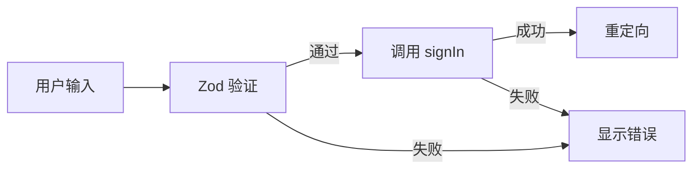
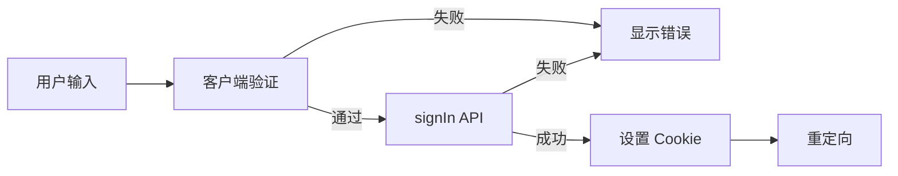
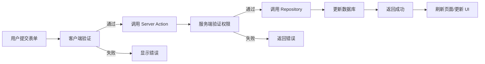

# 前端逻辑设计文档

## 概述

本文档描述用户认证与用户管理系统的前端架构、组件设计、状态管理和路由逻辑。使用 **Next.js 16 App Router**、**React 19**、**Shadcn UI**、**Tailwind CSS** 和 **react-hook-form + Zod**。

## 一、技术栈

- **框架**: Next.js 16 App Router
- **UI 库**: React 19
- **组件库**: Shadcn UI（基于 Radix UI）
- **样式**: Tailwind CSS 4
- **表单**: react-hook-form + Zod
- **状态管理**: React Server Components（服务端状态）+ 客户端 useState/useEffect（本地状态）
- **路由**: Next.js App Router（文件系统路由）

## 二、页面结构

### 2.1 路由结构

```
src/app/
├── layout.tsx              # 根布局（导航栏、Session 提供）
├── page.tsx                # 首页 (/)
├── login/
│   └── page.tsx            # 登录页 (/login)
├── register/
│   └── page.tsx            # 注册页 (/register)
├── profile/
│   ├── layout.tsx          # 受保护布局（验证登录）
│   ├── page.tsx            # 个人中心 (/profile)
│   └── actions.ts          # Server Actions
└── admin/
    └── users/
        ├── layout.tsx      # 管理员布局（验证权限）
        ├── page.tsx        # 用户管理页 (/admin/users)
        └── actions.ts      # Server Actions
```

### 2.2 页面组件设计

#### 2.2.1 登录页 (`/login`)

**文件**: `src/app/login/page.tsx`

**功能**:
- 邮箱密码登录表单
- Google OAuth 登录按钮（可选）
- 跳转到注册页链接
- 登录成功后重定向到 `callbackUrl` 或首页

**组件结构**:
```typescript
LoginPage
├── LoginForm (客户端组件)
│   ├── EmailInput
│   ├── PasswordInput
│   ├── SubmitButton
│   └── ErrorMessage
├── GoogleSignInButton (客户端组件)
└── RegisterLink
```

**状态管理**:
- 表单状态：`react-hook-form` 管理
- 错误状态：`useState` 管理错误消息
- 加载状态：`useState` 管理提交中状态

**表单验证** (Zod Schema):
```typescript
const loginSchema = z.object({
  email: z.string().email('请输入有效邮箱'),
  password: z.string().min(8, '密码至少8位')
})
```

**登录流程**:


#### 2.2.2 注册页 (`/register`)

**文件**: `src/app/register/page.tsx`

**功能**:
- 注册表单（邮箱、密码、确认密码、可选用户名）
- 表单验证（邮箱格式、密码强度、两次密码一致）
- 提交后自动登录或跳转到登录页

**组件结构**:
```typescript
RegisterPage
└── RegisterForm (客户端组件)
    ├── EmailInput
    ├── PasswordInput
    ├── ConfirmPasswordInput
    ├── NameInput (可选)
    ├── SubmitButton
    └── ErrorMessage
```

**表单验证**:
```typescript
const registerSchema = z.object({
  email: z.string().email('请输入有效邮箱'),
  password: z.string()
    .min(8, '密码至少8位')
    .regex(/[A-Z]/, '密码需包含大写字母')
    .regex(/[a-z]/, '密码需包含小写字母')
    .regex(/[0-9]/, '密码需包含数字'),
  confirmPassword: z.string(),
  name: z.string().max(100).optional()
}).refine((data) => data.password === data.confirmPassword, {
  message: '两次密码不一致',
  path: ['confirmPassword']
})
```

#### 2.2.3 个人中心 (`/profile`)

**文件**: `src/app/profile/page.tsx`

**功能**:
- 显示当前用户信息（头像、邮箱、名称）
- 编辑用户资料表单
- 修改密码表单（仅 Credentials 用户）

**组件结构**:
```typescript
ProfilePage (服务端组件)
├── ProfileHeader (显示头像、邮箱)
└── ProfileForm (客户端组件)
    ├── EditProfileForm
    │   ├── NameInput
    │   ├── ImageInput
    │   └── SubmitButton
    └── ChangePasswordForm (条件渲染)
        ├── CurrentPasswordInput
        ├── NewPasswordInput
        ├── ConfirmPasswordInput
        └── SubmitButton
```

**权限检查**:
- 在 `layout.tsx` 或 `page.tsx` 中使用 `await auth()` 检查登录状态
- 未登录时重定向到 `/login?callbackUrl=/profile`

**数据获取**:
- 服务端组件直接调用 `await auth()` 获取 session
- 表单提交通过 Server Action 更新数据

#### 2.2.4 管理员用户管理页 (`/admin/users`)

**文件**: `src/app/admin/users/page.tsx`

**功能**:
- 用户列表表格（分页、搜索、筛选）
- 编辑用户（内联或弹窗）
- 删除用户
- 创建新用户（可选）

**组件结构**:
```typescript
AdminUsersPage (服务端组件)
├── UsersTable (服务端组件，获取数据)
│   ├── SearchBar (客户端组件)
│   ├── RoleFilter (客户端组件)
│   ├── UsersTableContent (客户端组件)
│   │   ├── TableHeader
│   │   ├── TableRow (每行)
│   │   │   ├── EditButton
│   │   │   └── DeleteButton
│   │   └── Pagination
│   └── CreateUserDialog (客户端组件)
│       └── CreateUserForm
└── EditUserDialog (客户端组件)
    └── EditUserForm
```

**状态管理**:
- 列表数据：服务端获取，通过 props 传递
- 搜索/筛选：客户端状态，提交后重新获取数据（或使用 URL searchParams）
- 编辑/删除：客户端状态管理对话框显示

**分页与搜索**:
- 使用 URL searchParams 管理分页和搜索状态（符合 Next.js 最佳实践）
- 或使用 `useState` + Server Action 重新获取数据

## 三、组件设计

### 3.1 共享组件

#### 3.1.1 表单组件（基于 Shadcn UI）

**位置**: `src/components/ui/`（Shadcn 自动生成）

- `Button`: 按钮
- `Input`: 输入框
- `Label`: 标签
- `Card`: 卡片容器
- `Table`: 表格
- `Dialog`: 对话框
- `Form`: 表单容器（配合 react-hook-form）

#### 3.1.2 业务组件

**位置**: `src/components/`

- `auth/LoginForm.tsx`: 登录表单
- `auth/RegisterForm.tsx`: 注册表单
- `auth/GoogleSignInButton.tsx`: Google 登录按钮
- `profile/ProfileForm.tsx`: 个人资料表单
- `profile/ChangePasswordForm.tsx`: 修改密码表单
- `admin/UsersTable.tsx`: 用户列表表格
- `admin/EditUserDialog.tsx`: 编辑用户对话框
- `admin/CreateUserDialog.tsx`: 创建用户对话框

### 3.2 表单组件设计模式

所有表单使用统一模式：

```typescript
'use client'

import { useForm } from 'react-hook-form'
import { zodResolver } from '@hookform/resolvers/zod'
import { z } from 'zod'

const schema = z.object({...})

export function MyForm() {
  const form = useForm({
    resolver: zodResolver(schema),
    defaultValues: {...}
  })

  async function onSubmit(data: z.infer<typeof schema>) {
    // 调用 Server Action
    const result = await myAction(data)
    if (result.success) {
      // 成功处理
    } else {
      // 错误处理
      form.setError('root', { message: result.error })
    }
  }

  return (
    <Form {...form}>
      <form onSubmit={form.handleSubmit(onSubmit)}>
        {/* 表单字段 */}
      </form>
    </Form>
  )
}
```

## 四、状态管理

### 4.1 服务端状态（Session）

**获取方式**:
- 服务端组件：`const session = await auth()`
- 客户端组件：`useSession()`（需要 SessionProvider）

**SessionProvider 配置**:
在根布局中提供（如果需要客户端访问 session）：

```typescript
// src/app/layout.tsx
import { SessionProvider } from 'next-auth/react'

export default function RootLayout({ children }) {
  return (
    <html>
      <body>
        <SessionProvider>
          {children}
        </SessionProvider>
      </body>
    </html>
  )
}
```

### 4.2 客户端状态

- **表单状态**: `react-hook-form` 管理
- **UI 状态**: `useState`（对话框显示、加载状态等）
- **URL 状态**: `useSearchParams`（分页、搜索、筛选）

### 4.3 全局状态（如需要）

如果未来需要全局状态管理，可使用 **Zustand**（符合 workspace 规范）。

## 五、路由保护

### 5.1 服务端路由保护

**方式一：在页面组件中检查**

```typescript
// src/app/profile/page.tsx
import { auth } from '@/auth'
import { redirect } from 'next/navigation'

export default async function ProfilePage() {
  const session = await auth()
  if (!session) {
    redirect('/login?callbackUrl=/profile')
  }
  // 渲染页面
}
```

**方式二：在 Layout 中检查**

```typescript
// src/app/profile/layout.tsx
import { auth } from '@/auth'
import { redirect } from 'next/navigation'

export default async function ProfileLayout({ children }) {
  const session = await auth()
  if (!session) {
    redirect('/login?callbackUrl=/profile')
  }
  return <>{children}</>
}
```

**方式三：使用 proxy.ts（Next.js 16）**

```typescript
// proxy.ts
export { auth as proxy } from '@/auth'
```

在 `auth.ts` 中配置 `authorized` 回调：

```typescript
export const { handlers, auth, signIn, signOut } = NextAuth({
  // ...
  authorized({ auth, request: { nextUrl } }) {
    const isLoggedIn = !!auth?.user
    const isOnProtectedRoute = nextUrl.pathname.startsWith('/profile') || 
                                nextUrl.pathname.startsWith('/admin')
    if (isOnProtectedRoute && !isLoggedIn) {
      return Response.redirect(new URL('/login', nextUrl))
    }
    return true
  }
})
```

### 5.2 管理员权限检查

```typescript
// src/app/admin/users/page.tsx
import { auth } from '@/auth'
import { redirect } from 'next/navigation'

export default async function AdminUsersPage() {
  const session = await auth()
  if (!session) {
    redirect('/login')
  }
  if (session.user.role !== 'ADMIN') {
    redirect('/') // 或返回 403
  }
  // 渲染管理员页面
}
```

## 六、错误处理

### 6.1 表单错误

- **客户端验证**: Zod schema 验证，错误显示在字段下方
- **服务端错误**: Server Action 返回错误，通过 `form.setError('root', ...)` 显示

### 6.2 全局错误边界

```typescript
// src/app/error.tsx
'use client'

export default function Error({
  error,
  reset
}: {
  error: Error & { digest?: string }
  reset: () => void
}) {
  return (
    <div>
      <h2>出错了</h2>
      <button onClick={reset}>重试</button>
    </div>
  )
}
```

### 6.3 404 页面

```typescript
// src/app/not-found.tsx
export default function NotFound() {
  return <h2>页面不存在</h2>
}
```

## 七、UI/UX 设计

### 7.1 设计原则

- **响应式**: 移动端优先，使用 Tailwind 响应式类
- **无障碍**: 使用语义化 HTML，ARIA 属性（Shadcn/Radix 已处理）
- **加载状态**: 所有异步操作显示加载指示器
- **错误提示**: 清晰的错误消息，友好的用户提示

### 7.2 样式规范

- **主色调**: 使用 Tailwind 默认主题或自定义
- **间距**: Tailwind spacing scale（4px 基准）
- **字体**: Geist Sans（已在 layout.tsx 配置）
- **组件样式**: Shadcn UI 组件 + Tailwind 工具类

### 7.3 加载状态

```typescript
// 示例：提交按钮加载状态
<Button disabled={form.formState.isSubmitting}>
  {form.formState.isSubmitting ? '提交中...' : '提交'}
</Button>
```

## 八、数据流

### 8.1 登录流程



### 8.2 数据更新流程



## 九、性能优化

### 9.1 服务端组件

- 尽可能使用服务端组件（默认）
- 仅在需要交互时使用 `'use client'`

### 9.2 代码分割

- Next.js 自动代码分割
- 动态导入大型组件：`const Component = dynamic(() => import('./Component'))`

### 9.3 图片优化

- 使用 `next/image` 组件
- 头像使用 WebP 格式

### 9.4 缓存策略

- 服务端数据：使用 `cache` 或 `unstable_cache`（如需要）
- 静态页面：Next.js 自动静态生成

## 十、测试考虑（未来）

- **单元测试**: Jest + React Testing Library
- **E2E 测试**: Playwright 或 Cypress
- **组件测试**: Storybook（可选）
