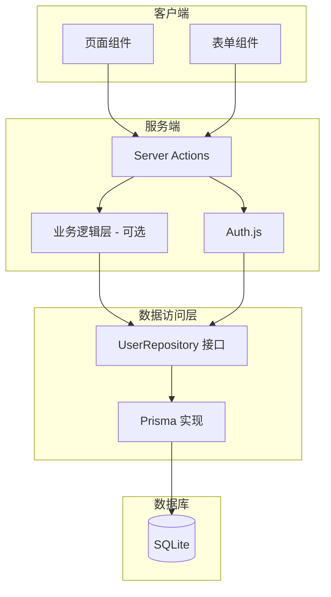

# 后端逻辑设计文档

## 概述

本文档描述用户认证与用户管理系统的后端架构、业务逻辑、数据访问层和服务端操作设计。使用 **Next.js Server Actions**、**Auth.js**、**Prisma** 和 **仓储模式**。

## 一、架构层次



### 1.1 层次说明

1. **Server Actions**: 处理 HTTP 请求，验证权限，调用业务逻辑
2. **业务逻辑层**（可选）: 封装复杂业务规则，当前简单场景可直接在 Actions 中处理
3. **数据访问层**: 仓储接口 + 实现，与数据库解耦
4. **数据库**: SQLite（可替换）

## 二、数据访问层（Repository Pattern）

### 2.1 领域类型定义

**文件**: `src/lib/repositories/types.ts`

```typescript
// 用户角色
export type UserRole = 'USER' | 'ADMIN'

// 用户领域模型（不含敏感信息）
export interface User {
  id: string
  email: string | null
  name: string | null
  image: string | null
  role: UserRole
  createdAt: Date
  updatedAt: Date
}

// 用户（含 password，仅内部使用）
export interface UserWithPassword extends User {
  password: string | null
}

// 创建用户输入
export interface CreateUserInput {
  email: string
  password?: string
  name?: string
  image?: string
  role?: UserRole
}

// 更新用户输入
export interface UpdateUserInput {
  email?: string
  password?: string
  name?: string
  image?: string
  role?: UserRole
}

// 列表查询参数
export interface ListUsersQuery {
  page?: number // 页码，从 1 开始
  pageSize?: number // 每页数量
  search?: string // 搜索关键词（email 或 name）
  role?: UserRole // 角色过滤
}

// 列表查询结果
export interface ListUsersResult {
  users: User[]
  total: number
  page: number
  pageSize: number
  totalPages: number
}
```

### 2.2 仓储接口

**文件**: `src/lib/repositories/user-repository.ts`

```typescript
import type {
  User,
  UserWithPassword,
  CreateUserInput,
  UpdateUserInput,
  ListUsersQuery,
  ListUsersResult
} from './types'

/**
 * 用户仓储接口
 * 所有数据库操作通过此接口，便于更换数据库实现
 */
export interface IUserRepository {
  /**
   * 根据 ID 查找用户
   */
  findById(id: string): Promise<User | null>

  /**
   * 根据邮箱查找用户（含 password，用于登录验证）
   */
  findByEmail(email: string): Promise<UserWithPassword | null>

  /**
   * 创建用户
   */
  create(data: CreateUserInput): Promise<User>

  /**
   * 更新用户
   */
  update(id: string, data: UpdateUserInput): Promise<User>

  /**
   * 删除用户
   */
  delete(id: string): Promise<void>

  /**
   * 分页查询用户列表
   */
  list(query: ListUsersQuery): Promise<ListUsersResult>
}
```

### 2.3 Prisma 实现

**文件**: `src/lib/repositories/implementations/prisma-user-repository.ts`

```typescript
import { PrismaClient } from '@prisma/client'
import type { IUserRepository } from '../user-repository'
import type {
  User,
  UserWithPassword,
  CreateUserInput,
  UpdateUserInput,
  ListUsersQuery,
  ListUsersResult
} from '../types'

export class PrismaUserRepository implements IUserRepository {
  constructor(private prisma: PrismaClient) {}

  async findById(id: string): Promise<User | null> {
    const user = await this.prisma.user.findUnique({
      where: { id }
    })
    return user ? this.mapToUser(user) : null
  }

  async findByEmail(email: string): Promise<UserWithPassword | null> {
    const user = await this.prisma.user.findUnique({
      where: { email }
    })
    return user ? this.mapToUserWithPassword(user) : null
  }

  async create(data: CreateUserInput): Promise<User> {
    const user = await this.prisma.user.create({
      data: {
        email: data.email,
        password: data.password, // 注意：password 应该已加密
        name: data.name,
        image: data.image,
        role: data.role || 'USER'
      }
    })
    return this.mapToUser(user)
  }

  async update(id: string, data: UpdateUserInput): Promise<User> {
    const user = await this.prisma.user.update({
      where: { id },
      data: {
        ...(data.email && { email: data.email }),
        ...(data.password && { password: data.password }), // 注意：password 应该已加密
        ...(data.name !== undefined && { name: data.name }),
        ...(data.image !== undefined && { image: data.image }),
        ...(data.role && { role: data.role })
      }
    })
    return this.mapToUser(user)
  }

  async delete(id: string): Promise<void> {
    await this.prisma.user.delete({
      where: { id }
    })
    // 外键约束会自动删除关联的 Account 和 Session
  }

  async list(query: ListUsersQuery): Promise<ListUsersResult> {
    const { page = 1, pageSize = 10, search, role } = query
    const skip = (page - 1) * pageSize

    const where: any = {}

    if (search) {
      where.OR = [
        { email: { contains: search } },
        { name: { contains: search } }
      ]
    }

    if (role) {
      where.role = role
    }

    const [users, total] = await Promise.all([
      this.prisma.user.findMany({
        where,
        skip,
        take: pageSize,
        orderBy: { createdAt: 'desc' },
        select: {
          id: true,
          email: true,
          name: true,
          image: true,
          role: true,
          createdAt: true,
          updatedAt: true
          // 不选择 password
        }
      }),
      this.prisma.user.count({ where })
    ])

    return {
      users: users.map(this.mapToUser),
      total,
      page,
      pageSize,
      totalPages: Math.ceil(total / pageSize)
    }
  }

  // 映射 Prisma 模型到领域模型
  private mapToUser(prismaUser: any): User {
    return {
      id: prismaUser.id,
      email: prismaUser.email,
      name: prismaUser.name,
      image: prismaUser.image,
      role: prismaUser.role as UserRole,
      createdAt: prismaUser.createdAt,
      updatedAt: prismaUser.updatedAt
    }
  }

  private mapToUserWithPassword(prismaUser: any): UserWithPassword {
    return {
      ...this.mapToUser(prismaUser),
      password: prismaUser.password
    }
  }
}
```

### 2.4 仓储导出

**文件**: `src/lib/repositories/index.ts`

```typescript
import { PrismaClient } from '@prisma/client'
import { PrismaUserRepository } from './implementations/prisma-user-repository'
import type { IUserRepository } from './user-repository'

// Prisma 客户端单例
const globalForPrisma = globalThis as unknown as { prisma: PrismaClient }

export const prisma =
  globalForPrisma.prisma ||
  new PrismaClient({
    log:
      process.env.NODE_ENV === 'development'
        ? ['query', 'error', 'warn']
        : ['error']
  })

if (process.env.NODE_ENV !== 'production') {
  globalForPrisma.prisma = prisma
}

// 创建仓储实例（可根据环境变量切换实现）
export const userRepository: IUserRepository = new PrismaUserRepository(prisma)

// 未来可扩展：
// if (process.env.DB_ADAPTER === 'drizzle') {
//   export const userRepository = new DrizzleUserRepository(...)
// }
```

## 三、Auth.js 配置

### 3.1 Auth 配置文件

**文件**: `auth.ts` 或 `src/auth.ts`

```typescript
import NextAuth from 'next-auth'
import { PrismaAdapter } from '@auth/prisma-adapter'
import Credentials from 'next-auth/providers/credentials'
import Google from 'next-auth/providers/google'
import { prisma } from '@/lib/repositories'
import { userRepository } from '@/lib/repositories'
import bcrypt from 'bcryptjs'

export const { handlers, auth, signIn, signOut } = NextAuth({
  adapter: PrismaAdapter(prisma),

  providers: [
    // Credentials 提供商（邮箱密码）
    Credentials({
      name: 'Credentials',
      credentials: {
        email: { label: 'Email', type: 'email' },
        password: { label: 'Password', type: 'password' }
      },
      async authorize(credentials) {
        if (!credentials?.email || !credentials?.password) {
          return null
        }

        // 通过仓储查找用户
        const user = await userRepository.findByEmail(
          credentials.email as string
        )
        if (!user || !user.password) {
          return null
        }

        // 验证密码
        const isValid = await bcrypt.compare(
          credentials.password as string,
          user.password
        )

        if (!isValid) {
          return null
        }

        // 返回用户信息（不含 password）
        return {
          id: user.id,
          email: user.email!,
          name: user.name,
          image: user.image,
          role: user.role
        }
      }
    }),

    // Google OAuth（可选）
    Google({
      clientId: process.env.AUTH_GOOGLE_ID,
      clientSecret: process.env.AUTH_GOOGLE_SECRET
    })
  ],

  session: {
    strategy: 'database' // 使用数据库会话
  },

  pages: {
    signIn: '/login' // 自定义登录页
  },

  callbacks: {
    // 在 session 中添加 role
    async session({ session, user }) {
      if (session.user) {
        session.user.id = user.id
        session.user.role = user.role as 'USER' | 'ADMIN'
      }
      return session
    }
  }
})
```

### 3.2 API 路由

**文件**: `src/app/api/auth/[...nextauth]/route.ts`

```typescript
import { handlers } from '@/auth'

export const { GET, POST } = handlers
```

### 3.3 路由保护（proxy.ts）

**文件**: `proxy.ts`（根目录）

```typescript
export { auth as proxy } from '@/auth'
```

## 四、Server Actions 设计

### 4.1 用户注册

**文件**: `src/app/register/actions.ts`

```typescript
'use server'

import { userRepository } from '@/lib/repositories'
import { signIn } from '@/auth'
import bcrypt from 'bcryptjs'
import { z } from 'zod'

const registerSchema = z.object({
  email: z.string().email('无效邮箱'),
  password: z.string().min(8, '密码至少8位'),
  name: z.string().max(100).optional()
})

export async function registerUser(data: unknown) {
  try {
    // 验证输入
    const validated = registerSchema.parse(data)

    // 检查邮箱是否已存在
    const existing = await userRepository.findByEmail(validated.email)
    if (existing) {
      return {
        success: false,
        error: '邮箱已被注册',
        code: 'EMAIL_EXISTS'
      }
    }

    // 加密密码
    const hashedPassword = await bcrypt.hash(validated.password, 10)

    // 创建用户
    const user = await userRepository.create({
      email: validated.email,
      password: hashedPassword,
      name: validated.name
    })

    // 自动登录
    await signIn('credentials', {
      email: validated.email,
      password: validated.password,
      redirect: false
    })

    return {
      success: true,
      userId: user.id
    }
  } catch (error) {
    if (error instanceof z.ZodError) {
      return {
        success: false,
        error: error.errors[0].message,
        code: 'VALIDATION_ERROR'
      }
    }
    return {
      success: false,
      error: '注册失败，请稍后重试',
      code: 'DATABASE_ERROR'
    }
  }
}
```

### 4.2 更新用户资料

**文件**: `src/app/profile/actions.ts`

```typescript
'use server'

import { auth } from '@/auth'
import { userRepository } from '@/lib/repositories'
import { redirect } from 'next/navigation'
import { z } from 'zod'

const updateProfileSchema = z.object({
  name: z.string().max(100).optional(),
  image: z.string().url().optional().or(z.literal(''))
})

export async function updateProfile(data: unknown) {
  const session = await auth()
  if (!session?.user) {
    redirect('/login?callbackUrl=/profile')
  }

  try {
    const validated = updateProfileSchema.parse(data)

    const user = await userRepository.update(session.user.id, {
      name: validated.name,
      image: validated.image || null
    })

    return {
      success: true,
      user
    }
  } catch (error) {
    if (error instanceof z.ZodError) {
      return {
        success: false,
        error: error.errors[0].message,
        code: 'VALIDATION_ERROR'
      }
    }
    return {
      success: false,
      error: '更新失败，请稍后重试',
      code: 'DATABASE_ERROR'
    }
  }
}
```

### 4.3 修改密码

**文件**: `src/app/profile/actions.ts`

```typescript
'use server'

import { auth } from '@/auth'
import { userRepository } from '@/lib/repositories'
import { redirect } from 'next/navigation'
import bcrypt from 'bcryptjs'
import { z } from 'zod'

const changePasswordSchema = z.object({
  currentPassword: z.string(),
  newPassword: z.string().min(8, '新密码至少8位')
})

export async function changePassword(data: unknown) {
  const session = await auth()
  if (!session?.user?.email) {
    redirect('/login')
  }

  try {
    const validated = changePasswordSchema.parse(data)

    // 获取用户（含 password）
    const user = await userRepository.findByEmail(session.user.email)
    if (!user || !user.password) {
      return {
        success: false,
        error: 'OAuth 用户无法修改密码',
        code: 'OAUTH_USER'
      }
    }

    // 验证旧密码
    const isValid = await bcrypt.compare(
      validated.currentPassword,
      user.password
    )
    if (!isValid) {
      return {
        success: false,
        error: '当前密码错误',
        code: 'INVALID_PASSWORD'
      }
    }

    // 加密新密码
    const hashedPassword = await bcrypt.hash(validated.newPassword, 10)

    // 更新密码
    await userRepository.update(user.id, {
      password: hashedPassword
    })

    return {
      success: true
    }
  } catch (error) {
    if (error instanceof z.ZodError) {
      return {
        success: false,
        error: error.errors[0].message,
        code: 'VALIDATION_ERROR'
      }
    }
    return {
      success: false,
      error: '修改失败，请稍后重试',
      code: 'DATABASE_ERROR'
    }
  }
}
```

### 4.4 管理员：获取用户列表

**文件**: `src/app/admin/users/actions.ts`

```typescript
'use server'

import { auth } from '@/auth'
import { userRepository } from '@/lib/repositories'
import { redirect } from 'next/navigation'
import { z } from 'zod'

const listUsersSchema = z.object({
  page: z.number().min(1).default(1),
  pageSize: z.number().min(1).max(50).default(10),
  search: z.string().optional(),
  role: z.enum(['USER', 'ADMIN']).optional()
})

export async function listUsers(query: unknown) {
  const session = await auth()
  if (!session?.user) {
    redirect('/login')
  }
  if (session.user.role !== 'ADMIN') {
    redirect('/')
  }

  try {
    const validated = listUsersSchema.parse(query)
    const result = await userRepository.list(validated)
    return {
      success: true,
      ...result
    }
  } catch (error) {
    return {
      success: false,
      error: '获取用户列表失败',
      code: 'DATABASE_ERROR'
    }
  }
}
```

### 4.5 管理员：更新用户

**文件**: `src/app/admin/users/actions.ts`

```typescript
'use server'

import { auth } from '@/auth'
import { userRepository } from '@/lib/repositories'
import { redirect } from 'next/navigation'
import { z } from 'zod'

const updateUserSchema = z.object({
  name: z.string().max(100).optional(),
  email: z.string().email().optional(),
  role: z.enum(['USER', 'ADMIN']).optional(),
  image: z.string().url().optional().or(z.literal(''))
})

export async function updateUser(userId: string, data: unknown) {
  const session = await auth()
  if (!session?.user || session.user.role !== 'ADMIN') {
    redirect('/login')
  }

  try {
    const validated = updateUserSchema.parse(data)

    // 如果更新邮箱，检查是否已被使用
    if (validated.email) {
      const existing = await userRepository.findByEmail(validated.email)
      if (existing && existing.id !== userId) {
        return {
          success: false,
          error: '邮箱已被其他用户使用',
          code: 'EMAIL_EXISTS'
        }
      }
    }

    const user = await userRepository.update(userId, validated)
    return {
      success: true,
      user
    }
  } catch (error) {
    if (error instanceof z.ZodError) {
      return {
        success: false,
        error: error.errors[0].message,
        code: 'VALIDATION_ERROR'
      }
    }
    return {
      success: false,
      error: '更新失败，请稍后重试',
      code: 'DATABASE_ERROR'
    }
  }
}
```

### 4.6 管理员：删除用户

**文件**: `src/app/admin/users/actions.ts`

```typescript
'use server'

import { auth } from '@/auth'
import { userRepository } from '@/lib/repositories'
import { redirect } from 'next/navigation'

export async function deleteUser(userId: string) {
  const session = await auth()
  if (!session?.user || session.user.role !== 'ADMIN') {
    redirect('/login')
  }

  // 防止删除自己
  if (session.user.id === userId) {
    return {
      success: false,
      error: '不能删除自己的账户',
      code: 'CANNOT_DELETE_SELF'
    }
  }

  try {
    await userRepository.delete(userId)
    return {
      success: true
    }
  } catch (error) {
    return {
      success: false,
      error: '删除失败，请稍后重试',
      code: 'DATABASE_ERROR'
    }
  }
}
```

### 4.7 管理员：创建用户

**文件**: `src/app/admin/users/actions.ts`

```typescript
'use server'

import { auth } from '@/auth'
import { userRepository } from '@/lib/repositories'
import { redirect } from 'next/navigation'
import bcrypt from 'bcryptjs'
import { z } from 'zod'

const createUserSchema = z.object({
  email: z.string().email('无效邮箱'),
  password: z.string().min(8, '密码至少8位'),
  name: z.string().max(100).optional(),
  role: z.enum(['USER', 'ADMIN']).default('USER')
})

export async function createUser(data: unknown) {
  const session = await auth()
  if (!session?.user || session.user.role !== 'ADMIN') {
    redirect('/login')
  }

  try {
    const validated = createUserSchema.parse(data)

    // 检查邮箱是否已存在
    const existing = await userRepository.findByEmail(validated.email)
    if (existing) {
      return {
        success: false,
        error: '邮箱已被使用',
        code: 'EMAIL_EXISTS'
      }
    }

    // 加密密码
    const hashedPassword = await bcrypt.hash(validated.password, 10)

    // 创建用户
    const user = await userRepository.create({
      email: validated.email,
      password: hashedPassword,
      name: validated.name,
      role: validated.role
    })

    return {
      success: true,
      user
    }
  } catch (error) {
    if (error instanceof z.ZodError) {
      return {
        success: false,
        error: error.errors[0].message,
        code: 'VALIDATION_ERROR'
      }
    }
    return {
      success: false,
      error: '创建失败，请稍后重试',
      code: 'DATABASE_ERROR'
    }
  }
}
```

## 五、错误处理

### 5.1 统一错误响应格式

所有 Server Actions 返回：

```typescript
// 成功
{ success: true, data?: T }

// 失败
{ success: false, error: string, code?: string }
```

### 5.2 错误代码

- `VALIDATION_ERROR`: 输入验证失败
- `UNAUTHORIZED`: 未登录
- `FORBIDDEN`: 权限不足
- `NOT_FOUND`: 资源不存在
- `EMAIL_EXISTS`: 邮箱已存在
- `INVALID_PASSWORD`: 密码错误
- `CANNOT_DELETE_SELF`: 不能删除自己
- `OAUTH_USER`: OAuth 用户无法执行该操作
- `DATABASE_ERROR`: 数据库错误

## 六、安全考虑

1. **密码加密**: 使用 `bcryptjs`，salt rounds = 10
2. **输入验证**: 所有输入使用 Zod schema 验证
3. **权限检查**: 所有受保护操作验证 session 和 role
4. **SQL 注入**: Prisma ORM 自动防护
5. **CSRF**: Next.js Server Actions 自动处理
6. **密码不返回**: 仓储接口返回的 User 不含 password

## 七、扩展性

### 7.1 更换数据库

1. 实现新的仓储类（如 `DrizzleUserRepository`）
2. 在 `repositories/index.ts` 中切换导出
3. 更换 Auth.js adapter（如 `@auth/drizzle-adapter`）
4. 业务逻辑无需改动

### 7.2 添加业务逻辑层

如果业务逻辑变复杂，可添加 Service 层：

```typescript
// src/lib/services/user-service.ts
export class UserService {
  constructor(private userRepository: IUserRepository) {}

  async registerUser(data: CreateUserInput) {
    // 复杂业务逻辑
  }
}
```
